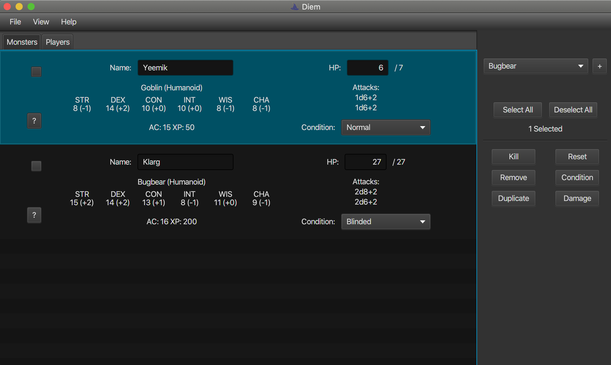

# Diem
A Tool to aid DMs everywhere.

# Releases
Releases are Java 13 fat jars, no no external modules are required. Downloadable Jars will be listed here when available.

### Credits
* /u/Endomorphism002 for the original [monster data spreadsheet](https://www.reddit.com/r/DnD/comments/3dfose/5e_monster_manual_spreadsheet/) which was converted into a CSV
* [This site](http://miroz.com.hr/random/monsters.html) for additional monster information such as stats and XP values